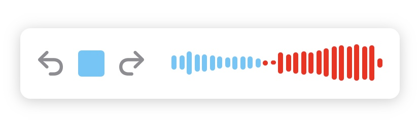

# SoundWavePlayer

SoundWavePlayer is a customizable view representing sounds over time.


# Adding View

```SoundPlayerView``` can be added to storyboard or instantiated programmatically:

```
let thisBundle = Bundle(for: type(of: self))
        guard let filePath = thisBundle.url(forResource: "witcher", withExtension: "mp3"), filePath.checkFileExist() else { return }
        
let playerView = SoundPlayerView()
        
view.addSubview(playerView)
playerView.centerYAnchor.constraint(equalTo: view.centerYAnchor).isActive = true
playerView.centerXAnchor.constraint(equalTo: view.centerXAnchor).isActive = true
playerView.heightAnchor.constraint(equalToConstant: 70).isActive = true
playerView.leadingAnchor.constraint(equalTo: view.leadingAnchor, constant: 20).isActive = true
playerView.trailingAnchor.constraint(equalTo: view.trailingAnchor, constant: -20).isActive = true
        
playerView.openAudioTrack(filePath)

```
